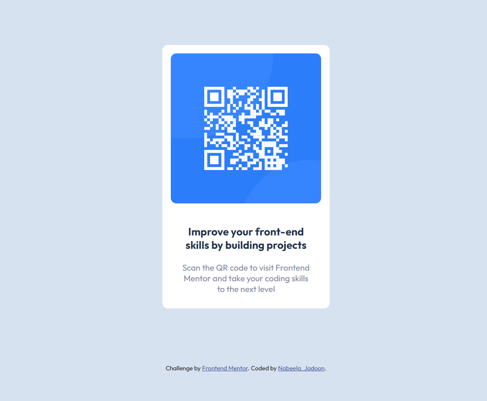

# Frontend Mentor - QR code component solution

## Overview
This is a solution to the [QR code component challenge on Frontend Mentor](https://www.frontendmentor.io/challenges/qr-code-component-iux_sIO_H). Frontend Mentor challenges help you improve your coding skills by building realistic projects. 
 

### Screenshot

### Links

- Solution URL: (https://github.com/nabeela-s/Challenge-qrCode-webDesign)
- Live Site URL: (https://fluffy-ganache-e58c84.netlify.app/)

### Built with

- Semantic HTML5 markup
- CSS custom properties

### What I learned

It is a simple project. Mostly I learned the workflow of *Fronend Mentor*. That I can use later to provide practice and built my portfolio.
